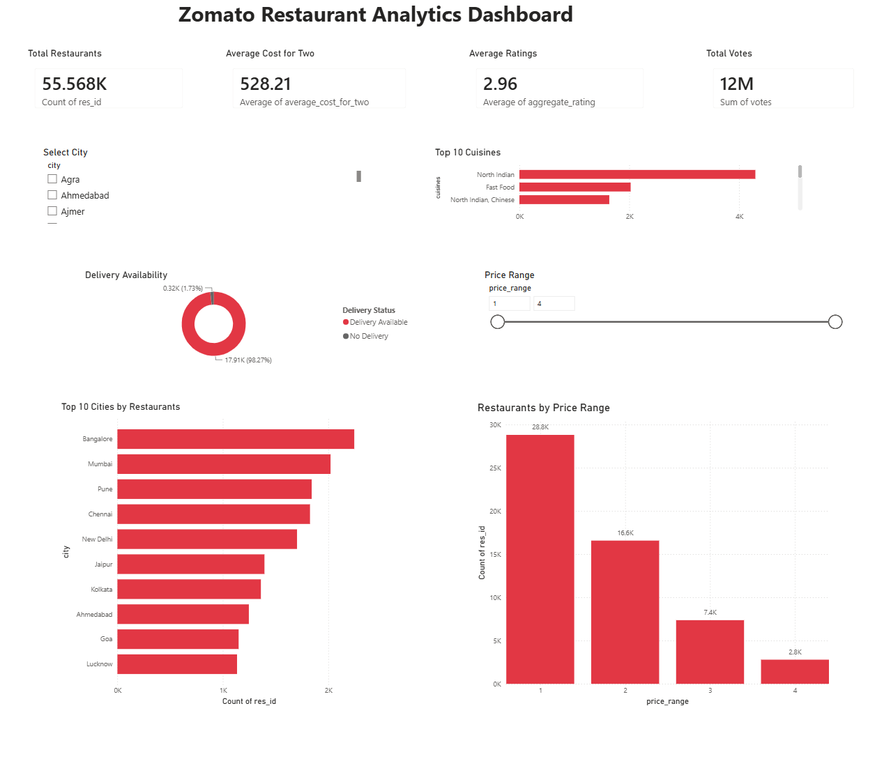

# 🍽️ Zomato Restaurant Analytics Dashboard

## 📌 Overview

This project is an end-to-end data analytics project built using Python and Power BI. The dataset was cleaned and analyzed using Python, and an interactive dashboard was developed in Power BI to visualize key business insights related to restaurants, cuisines, pricing, ratings, and delivery services.

---

## 📊 Dashboard Preview

---

## 🚀 Workflow

1. Data Collection
2. Data Cleaning using Python (Pandas)
3. Exploratory Data Analysis (EDA)
4. Business Insights
5. Interactive Dashboard Development in Power BI

---

## 📈 Dashboard Features

- Total Restaurants KPI
- Average Cost for Two
- Average Rating KPI
- Total Votes KPI
- Top 10 Cities by Restaurant Count
- Top 10 Cuisines
- Delivery Availability Analysis
- Restaurant Distribution by Price Range
- Interactive City and Price Range Filters

---

## 🛠️ Technologies Used

- Python
- Pandas
- NumPy
- Matplotlib
- Seaborn
- Power BI
- Power Query
- DAX

---

## 📊 Key Business Insights

- Identified cities with the highest number of restaurants.
- Analyzed the most popular cuisines across restaurants.
- Studied restaurant distribution across different price ranges.
- Compared restaurants offering delivery and non-delivery services.
- Evaluated customer engagement using ratings and votes.

---

## 📂 Repository Contents

- Zomato_Restaurant_Analytics.pbix
- zomato_cleaned.csv
- dashboard.png
- Python Analysis Notebook (.ipynb)

---

## 👩‍💻 Author

**Tanishka Singh**
Indira Ga     
